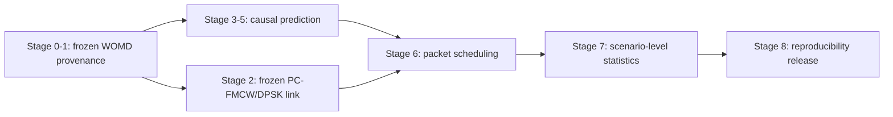

# Predictive PC-FMCW/DPSK Vehicular Communications

**Causal trajectory forecasting for deadline-aware optical vehicle scheduling**

**English** | [Ελληνικά](README_GR.md) · [Executable stages](stages) · [Repository architecture](docs/REPOSITORY_ARCHITECTURE.md) · [Paper draft](paper/PAPER_DRAFT.md)


> Can motion forecasts help a vehicle scheduler deliver packets before a
> directional optical link disappears - and does lower trajectory error
> actually imply better communication performance?

This repository connects real Waymo Open Motion Dataset (WOMD) trajectories to
a model-based PC-FMCW/DPSK optical link and a packet simulator with queues,
deadlines, retries and fairness. It extends the supplied Part-A physical layer;
it is **not** the separate joint beam/ADB project.

## Research questions

1. In which operating regions does motion prediction improve scheduling?
2. Does lower ADE/FDE imply better SNR, outage, link-lifetime and goodput fidelity?
3. Can communication-aware GRU training improve downstream packet delivery?



Ground-truth future motion is used only to realize and evaluate the link. A
deployable predictor or scheduler never sees it.

## Canonical Stage 0-8 workflow

The project is organized as nine gated folders under [`stages/`](stages).
Every folder owns its `stage.json`, direct `run.py`, stage README, dependencies,
commands, expected evidence and acceptance criteria. Reusable implementation
remains under `src/predictive_pc_fmcw/`; stage folders do not duplicate science.

| Stage | Folder | Purpose | Completion gate |
|---:|---|---|---|
| 0 | [`00_freeze_and_provenance`](stages/00_freeze_and_provenance) | Freeze protocol and split policy | Dataset hashes and zero scenario overlap |
| 1 | [`01_womd_data_pipeline`](stages/01_womd_data_pipeline) | Materialize/audit the frozen WOMD corpora | Source hashes, causal arrays, split/provenance gates |
| 2 | [`02_pc_fmcw_dpsk_link`](stages/02_pc_fmcw_dpsk_link) | Freeze the Part-A link mapping | Confidence-aware verified BER LUT |
| 3 | [`03_classical_baselines`](stages/03_classical_baselines) | Evaluate Last/CV/CA/Kalman/IMM | Reproducible development trajectory/link metrics |
| 4 | [`04_communication_aware_gru`](stages/04_communication_aware_gru) | Select loss weights and train GRUs | Four objectives × five seeds = 20 verified checkpoints |
| 5 | [`05_official_predictor_evaluation`](stages/05_official_predictor_evaluation) | Evaluate untouched validation | Frozen predictors evaluated once on official validation |
| 6 | [`06_packet_scheduling`](stages/06_packet_scheduling) | Run paired packet experiments | Eight schedulers × five paired traffic seeds |
| 7 | [`07_statistics_and_figures`](stages/07_statistics_and_figures) | Analyze operating regions | Scenario/episode inference, multiplicity-aware statistics |
| 8 | [`08_final_paper`](stages/08_final_paper) | Build the release | Final evidence, paper and reproducibility manifest |

Canonical generated evidence mirrors stage ownership:

```text
artifacts/paper_final/
├── 00_freeze/
├── 01_data/
├── 02_link/
├── 03_baselines/
├── 04_learning/
├── 05_heldout/
├── 06_scheduling/
├── 07_statistics/
└── 08_release/
```

`artifacts/paper_final/execution_state.json` and Stage-4-local execution-state
files are operational restart reports only. They never replace scientific
completion manifests, provenance reports or acceptance gates.

### One canonical operator path

```bash
# 1. Preflight: Stage 1 deliberately does not require Stage 2 or CUDA.
make canonical-preflight \
  WOMD_DATA_ROOT=/data/womd \
  TRAIN_NPZ=/data/womd/womd_training_paper.npz \
  VALIDATION_NPZ=/data/womd/womd_validation_paper.npz

# 2. Stage 1 provenance/corpus verification.
make canonical-stage1 \
  WOMD_DATA_ROOT=/data/womd \
  TRAIN_NPZ=/data/womd/womd_training_paper.npz \
  VALIDATION_NPZ=/data/womd/womd_validation_paper.npz

# 3. Full downstream canonical execution. This requires frozen Stage 2,
#    official-validation TFRecords and CUDA through the full preflight.
make canonical-full \
  WOMD_DATA_ROOT=/data/womd \
  TRAIN_NPZ=/data/womd/womd_training_paper.npz \
  VALIDATION_NPZ=/data/womd/womd_validation_paper.npz \
  VALIDATION_GLOB='/data/womd/validation/*.tfrecord'
```

For dependency-oriented inspection of individual research stages, use:

```bash
make stages
make stage STAGE=stage0
make stage STAGE=stage0 EXECUTE=--execute
```

## Current evidence - honestly separated

| Evidence | State |
|---|---|
| Trajectory → link → packet simulation | Implemented and tested |
| Part-A receiver-derived LUT | Executed on a 31-point SNR grid |
| Controlled scheduling study | Existing non-canonical development evidence retained |
| Historical WOMD training fingerprint | 249,137 samples / 24,182 scenarios; provenance fingerprint, not a target |
| Training/development leakage audit | Zero overlap required by the canonical gate |
| Earlier partial training attempt | Preserved as historical evidence; not canonical completion |
| Canonical learned archive | Pending until 20 verified checkpoints exist |
| Untouched official-validation corpus | Export supported; must remain outside model selection |
| Official learned scheduling evidence | Requires real validation data and checkpoints |
| Measured optical-channel validation | Not available and not claimed |

Historical training corpus SHA-256 recorded in prior evidence:
`b47faf427487a7405531e4944c5bfff9ca56d4fcb9ce3f8495df3cce534347ee`.
Historical counts and hashes are provenance fingerprints: the Stage-1 gate does
not force a new run to manufacture those counts.

## Why ADE is not enough

A small Cartesian error near the optical FoV boundary may cause a large
pointing-gain or outage error. The paper therefore evaluates the full chain:

\[
\mathrm{ADE/FDE}\rightarrow\{r,\theta\}\rightarrow
\{\mathrm{SNR},\mathrm{BER},\mathrm{PER},T_{link}\}\rightarrow
\{\mathrm{goodput},\mathrm{misses},\mathrm{latency}\}.
\]

The learned objective is

\[
\mathcal{L}=\lambda_{traj}\mathcal{L}_{traj}
+\lambda_{link}\mathcal{L}_{link}
+\lambda_{out}\mathcal{L}_{outage}.
\]

Stage 4 separately trains trajectory-only, trajectory+link,
trajectory+outage and full communication-aware GRUs. Lambda selection is
strictly development-only and is frozen before Stage 5.

## Included methods

Predictors:

- Last Position, Constant Velocity and Constant Acceleration;
- position-only Kalman CV and causal CV/CA IMM;
- deterministic GRU with four communication-loss objectives;
- development-fitted residual Gaussian calibration for held-out NLL and
  50/90/95% coverage;
- perfect-future information reference for evaluator-only bounds.

Schedulers:

- canonical Stage 6 uses exactly eight frozen scheduler families;
- every family is paired over exactly five frozen traffic seeds;
- information-oracle behavior remains evaluator-only and is not deployable.

## Installation and verification

```bash
sudo apt update
sudo apt install -y python3 python3-venv python3-pip build-essential
python3 -m venv .venv
source .venv/bin/activate
python -m pip install --upgrade pip
pip install -e ".[dev,ml,paper]"

make test
make lint
make validate
```

PyTorch is needed only for learned-model stages.

## External stage inputs

Copy [`stages/.env.example`](stages/.env.example) and set:

```bash
export WOMD_DATA_ROOT=/data/womd
export TRAIN_NPZ=/data/womd/womd_v131_training.npz
export VALIDATION_NPZ=/data/womd/womd_v131_official_validation.npz
export VALIDATION_TFRECORD='/data/womd/validation/*.tfrecord'
export CHECKPOINT_GLOB='artifacts/paper_final/04_learning/learned_ablation/*/seed_*/best_comm_aware_gru.pt'
export LAMBDA_LINK=0.2
export LAMBDA_OUTAGE=0.1
```

Loss weights are selected only on development data and frozen before official
validation is opened.

## Repository layout

```text
stages/                        canonical Stage 0-8 orchestration and contracts
├── 00_freeze_and_provenance/
├── 01_womd_data_pipeline/
├── 02_pc_fmcw_dpsk_link/
├── 03_classical_baselines/
├── 04_communication_aware_gru/
├── 05_official_predictor_evaluation/
├── 06_packet_scheduling/
├── 07_statistics_and_figures/
└── 08_final_paper/
src/predictive_pc_fmcw/        reusable scientific/software library
scripts/                       canonical and auxiliary executable entrypoints
configs/                       frozen physical/experimental assumptions
tests/                         regression and scientific gates
artifacts/paper_final/         canonical stage-aligned evidence
paper/                         manuscript source
notebooks/                     Colab GPU/data-acquisition operator workflow
reference/                     supplied-work provenance; not copied stage code
```

See [`docs/REPOSITORY_ARCHITECTURE.md`](docs/REPOSITORY_ARCHITECTURE.md) for
stage ownership, forbidden operations and the data → prediction → link →
scheduler → statistics → release flow.

## Scientific guardrails

- WOMD v1.3.1 protocol is frozen.
- No future information enters deployable decisions.
- Scenario overlap across data partitions is rejected.
- Hyperparameters are selected on development only; official validation is not model-selection data.
- Stage 4 is exactly four objectives × five frozen seeds.
- Stage 6 is exactly eight scheduler families × five paired traffic seeds.
- Schedulers receive paired traffic and channel randomness.
- Packet success uses the ground-truth-derived link only to realize/evaluate outcomes.
- WOMD scenario/episode is the independent statistical unit.
- Confirmatory comparisons use scenario-clustered uncertainty and multiplicity control.
- Finite zero-error Monte Carlo is not evidence that the true BER is exactly zero.
- Optical power is model-based unless measurements are supplied.
- Negative results and latency/reliability trade-offs remain visible.
- Frozen Stage-2 science is not changed for organizational convenience.

## Start here

- [Repository architecture](docs/REPOSITORY_ARCHITECTURE.md)
- [Executable stage workspace](stages)
- [Greek execution guide](docs/STAGED_EXECUTION_GR.md)
- [Scientific audit and plan](docs/SCIENTIFIC_AUDIT_AND_PLAN.md)
- [WOMD audit](docs/WOMD_DATASET_AUDIT.md)
- [Data provenance](docs/DATA_PROVENANCE.md)
- [2026 implementation roadmap](docs/ROADMAP_IMPLEMENTATION_2026.md)

## Publication status

This is a tested research implementation and a frozen publication protocol,
not a license to infer completion from file existence. Stage 8 requires the
20-checkpoint archive, untouched official-validation results, paired packet
experiments, scenario-clustered statistics and a clean reproducibility release.
