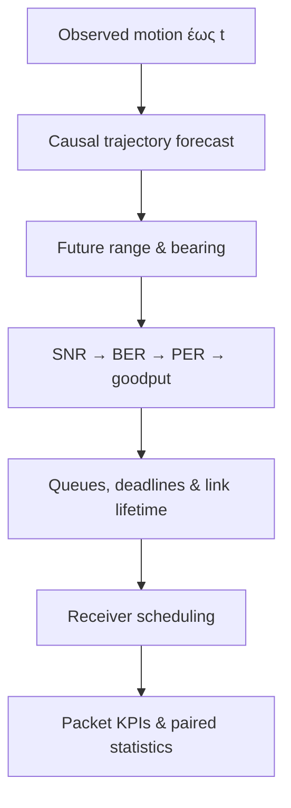

# Predictive PC-FMCW/DPSK Vehicular Communications


Το project μελετά ένα απλό αλλά σημαντικό ερώτημα:

> Αν γνωρίζουμε πού πιθανότατα θα κινηθούν τα οχήματα, μπορούμε να στείλουμε
> τα πακέτα νωρίτερα στα links που πρόκειται να χαθούν;

Η Εργασία 1 παρείχε το PC-FMCW/DPSK physical-layer υπόβαθρο. Η νέα εργασία
προσθέτει causal trajectory prediction, πρόβλεψη του μελλοντικού optical link,
ουρές πακέτων με deadlines και predictive scheduling. Δεν είναι το ξεχωριστό
Joint Beam/ADB project: εδώ η απόφαση είναι μόνο **ποιο όχημα εξυπηρετείται στο
τρέχον slot**.

## Κατάσταση με μία ματιά

| Μέρος | Κατάσταση |
|---|---|
| Trajectory → geometry → link → packets → scheduler | Υλοποιημένο |
| Classical predictors και 10 schedulers | Υλοποιημένα |
| Tests και scientific sanity gates | 45/45 PASS και 5/5 PASS |
| Corrected synthetic benchmark | Εκτελεσμένο, 12 ανεξάρτητα episodes |
| Compact WOMD proxy benchmark | Εκτελεσμένο, μόνο 3 scenes |
| Official WOMD true-SDC adapter | Υλοποιημένος, αλλά λείπουν τα TFRecord shards |
| Communication-aware GRU 4-objective ablation | Υλοποιημένη υποδομή, όχι εκτελεσμένη |
| Compatible trained checkpoint | Δεν δόθηκε |
| Measured optical-channel validation | Δεν υπάρχει και δεν δηλώνεται |
| Τελικό publication claim | Όχι ακόμη — research draft |

Το repository είναι σήμερα **πλήρης και ελεγμένη ερευνητική υποδομή**, αλλά
όχι τελικό paper evidence πάνω σε official WOMD. Αυτός ο διαχωρισμός είναι
σκόπιμος: κανένα αποτέλεσμα δεν κατασκευάζεται για να φαίνεται καλύτερο.

## Τι κάνει το σύστημα


1. Διαβάζει μόνο τις θέσεις μέχρι τη χρονική στιγμή `t`.
2. Προβλέπει causal τις επόμενες θέσεις κάθε οχήματος.
3. Μετατρέπει τις θέσεις σε απόσταση και γωνία ως προς το ego όχημα.
4. Υπολογίζει normalized optical gain, SNR, DBPSK BER, packet error rate,
   successful goodput, outage και link lifetime.
5. Συνδυάζει την πρόβλεψη με queue length, deadlines, fairness και switching
   cost.
6. Επιλέγει το πολύ ένα όχημα ανά slot.
7. Κρίνει την επιτυχία με το πραγματικό trajectory-derived link, ποτέ με την
   ίδια την πρόβλεψη.



## Τι είναι πραγματικό και τι προσομοιωμένο

| Στοιχείο | Προέλευση | Τι επιτρέπεται να ισχυριστούμε |
|---|---|---|
| Controlled trajectories | Συνθετικός generator | Software/mechanism validation |
| Compact WOMD trajectories | Πραγματική κίνηση, 3 scene IDs | Integration test με proxy ego |
| Official WOMD loader | True `sdc_track_index` και validity masks | Έτοιμος όταν δοθούν τα shards |
| PC-FMCW constants | Supplied Part-A notebook/report | Frozen physical assumptions |
| Optical power/SNR/channel | Reference-SNR model | Model-based, όχι measurement |
| BER | Analytical DBPSK ή adaptive Monte Carlo LUT | Reproducible simulation |
| Packet delivery | PER και common random numbers | Controlled paired comparison |

Η τιμή `received_power_w` είναι normalized reference quantity και συνοδεύεται
από `received_power_calibrated=false`. Δεν παρουσιάζεται ως μετρημένη ισχύς.

## Μέθοδοι που περιλαμβάνονται

Trajectory predictors:

- Last Position, Constant Velocity και Constant Acceleration,
- position-only Kalman CV,
- lightweight causal CV/CA IMM,
- optional versioned GRU checkpoint,
- perfect-future information reference.

Schedulers:

- Random, Round Robin, Reactive Greedy και Proportional Fair,
- CV, Kalman και IMM Predictive,
- generic Predictive Utility,
- Link-Lifetime urgency,
- perfect-future Oracle-information heuristic.

Το `oracle` δεν είναι μαθηματικό upper bound. Έχει τέλεια πληροφορία μέλλοντος,
αλλά χρησιμοποιεί την ίδια heuristic utility.

## Corrected αποτελέσματα

Τα παρακάτω προέρχονται αποκλειστικά από `artifacts/corrected_v1/`, μετά τις
διορθώσεις frame, heading, horizon, physical deadlines, outage semantics και
clustered inference.

| Policy | Goodput (Mbps) | PDR | P95 latency (ms) | Deadline ή censoring |
|---|---:|---:|---:|---:|
| Reactive Greedy | 2.293 | 0.644 | 699.6 | 0.356 |
| Kalman Predictive | 2.305 | 0.647 | 933.3 | 0.353 |
| Predictive Utility | 2.306 | 0.648 | 965.4 | 0.352 |
| Link Lifetime | 2.307 | 0.648 | 968.3 | 0.352 |
| Oracle-information | 2.308 | 0.648 | 968.3 | 0.352 |

Η paired διαφορά Link-Lifetime − Reactive είναι **+0.014 Mbps**, αλλά το
bootstrap 95% CI είναι **[−0.0319, +0.0593] Mbps** και το Holm-adjusted
Wilcoxon `p=1.0`. Άρα δεν υπάρχει ισχυρή ένδειξη goodput gain στο μικρό default
benchmark. Αντίθετα, το P95 latency χειροτερεύει κατά περίπου **269 ms**.

Στο compact WOMD proxy benchmark:

| Policy | Goodput (Mbps) | PDR | P95 latency (ms) |
|---|---:|---:|---:|
| Reactive Greedy | 1.160 | 0.329 | 368.3 |
| Link Lifetime | 1.056 | 0.299 | 400.0 |
| Oracle-information | 1.056 | 0.299 | 400.0 |

Το αποτέλεσμα είναι αρνητικό και παραμένει στο repository. Το two-seed staged
diagnostic βρίσκει επίσης αλλαγές προσήμου ανά load, deadline, horizon, channel
και sensing assumption. Η σωστή υπόθεση του paper δεν είναι «prediction always
wins», αλλά «πότε και υπό ποιες συνθήκες βοηθά η prediction;».


## Έγγραφα για διάβασμα

- [`output/pdf/predictive_pc_fmcw_corrected_research_draft.pdf`](output/pdf/predictive_pc_fmcw_corrected_research_draft.pdf): το εξασελίδο corrected research draft.
- [`docs/METHODOLOGY.md`](docs/METHODOLOGY.md): το μοντέλο, οι εξισώσεις και το experimental protocol.
- [`docs/RESULTS.md`](docs/RESULTS.md): αποτελέσματα, paired statistics και αρνητικά ευρήματα.
- [`docs/PDF_REQUIREMENTS_TRACEABILITY.md`](docs/PDF_REQUIREMENTS_TRACEABILITY.md): απαίτηση-προς-κώδικα/τεστ/artifact αντιστοίχιση.
- [`docs/PAPER_READINESS.md`](docs/PAPER_READINESS.md): τι είναι έτοιμο και τι μπλοκάρει ακόμη την υποβολή.

## Εγκατάσταση σε Ubuntu 26.04 / Intel ή AMD 64-bit

Από καθαρό clone:

```bash
sudo apt update
sudo apt install -y python3 python3-venv python3-pip build-essential

python3 -m venv .venv
source .venv/bin/activate
python -m pip install --upgrade pip
pip install -e ".[dev,paper]"
```

Για το optional learned GRU:

```bash
pip install -e ".[dev,ml]"
```

Το PyTorch δεν απαιτείται για τα classical predictors, schedulers, figures ή
packet experiments.

## Γρήγορος έλεγχος

```bash
make test
make lint
make validate
```

Αναμενόμενο αποτέλεσμα: 45 tests και όλα τα scientific gates σε `PASS`.

## Αναπαραγωγή των corrected artifacts

Το πλήρες γρήγορο integration run:

```bash
make corrected-quick
```

Δημιουργεί νέο, ανεξάρτητο run directory με:

- adaptive DBPSK BER LUT από −5 έως 25 dB,
- controlled και compact-WOMD proxy benchmarks,
- motion/link forecast metrics,
- traffic/channel/noise ablations,
- 430-row two-seed staged diagnostic,
- mobility/FoV scenario slices,
- CSV, JSON, LaTeX, figures και run manifest.

Για πέντε staged seeds και όλα τα ablation episodes:

```bash
make corrected-full
```

Το `corrected-full` είναι υπολογιστικά βαρύτερο. Δεν μετατρέπει το compact
proxy dataset σε official WOMD evidence.

## Official WOMD και learned ablation

Όταν υπάρχουν official WOMD v1.3.0 TFRecord shards και το Waymo proto package:

```bash
python scripts/01_build_official_womd_samples.py \
  /path/to/training.tfrecord-* \
  --output data/processed/womd_official_samples.npz \
  --max-vehicles 16
```

Ο adapter χρησιμοποιεί το πραγματικό `sdc_track_index`, δέχεται μόνο vehicle
tracks με έγκυρα states σε όλο το retained window και κρατά scenario-safe
splits.

Έλεγχος του 4-objective × 3-seed training plan χωρίς να ξεκινήσει training:

```bash
python scripts/04_run_training_ablation.py \
  data/processed/womd_official_samples.npz \
  --plan-only
```

Πραγματική εκπαίδευση:

```bash
python scripts/04_run_training_ablation.py \
  data/processed/womd_official_samples.npz \
  --output artifacts/learned_ablation \
  --seeds 20260827 20260828 20260829
```

Οι τέσσερις objectives είναι trajectory-only, trajectory+link,
trajectory+outage και full. Κάθε checkpoint αποθηκεύει versioned feature schema,
dataset SHA-256, split metadata και training seed. Ασύνδετο upstream checkpoint
χωρίς το σωστό schema απορρίπτεται.

## Δομή του repository

```text
src/predictive_pc_fmcw/       core library
├── data/                     synthetic, compact και official WOMD adapters
├── learning/                 GRU, losses, training και checkpoint validation
├── scheduling/               reactive και predictive policies
├── simulation/               packet-level engine
├── link.py / ber.py          PC-FMCW/DPSK-informed link abstraction
├── sensing.py                declared synthetic observation uncertainty
└── staged_experiments.py     deconfounded robustness studies

configs/                      frozen assumptions και experiment designs
scripts/                      numbered and one-command runners
tests/                        deterministic scientific regressions
artifacts/corrected_v1/       post-audit reproduced evidence
paper/                        current manuscript source
docs/                         methods, provenance, results και traceability
reference/                    supplied Part-A και Stage-4 provenance
```

## Scientific guardrails

- Κανένας deployable predictor δεν βλέπει future ground truth.
- Όλοι οι schedulers παίρνουν ίδια arrivals, deadlines και random draws.
- Το realized packet outcome υπολογίζεται από το ground-truth-derived link.
- Τα deadlines, horizons και episode duration συγκρίνονται σε φυσικά seconds.
- Τα statistics γίνονται σε ανεξάρτητο scenario/seed cluster level με Holm
  correction.
- Τα no-outage horizons και τα packets που μένουν στην ουρά καταγράφονται ως
  censoring, δεν εξαφανίζονται.
- Το sensing noise δηλώνεται ως synthetic assumption, όχι sensor measurement.
- Τα παλιά pre-fix artifacts δεν αναμειγνύονται με τα `corrected_v1` results.

## Τεκμηρίωση

- [Methodology](docs/METHODOLOGY.md)
- [Experiment protocol](docs/EXPERIMENTS.md)
- [Corrected results](docs/RESULTS.md)
- [Data provenance](docs/DATA_PROVENANCE.md)
- [PDF requirements traceability](docs/PDF_REQUIREMENTS_TRACEABILITY.md)
- [Exact implementation status](docs/IMPLEMENTATION_STATUS.md)
- [Paper-readiness assessment](docs/PAPER_READINESS.md)
- [Current manuscript](paper/PAPER_DRAFT.md)

## Citation status

Δεν υπάρχει ακόμη τελική δημοσίευση για citation. Αν χρησιμοποιηθεί το
repository τώρα, πρέπει να περιγραφεί ως research code/protocol με controlled
και compact-proxy evidence, όχι ως validated full-WOMD or measured-channel
system.
