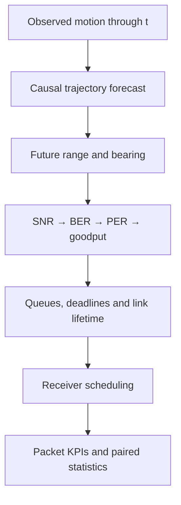

# Predictive PC-FMCW/DPSK Vehicular Communications

**English** | [Ελληνικά](README_GR.md)


This project studies a simple but consequential question:

> If we can anticipate where vehicles are going, can we serve packets earlier
> on optical links that are likely to disappear soon?

Part A supplied the PC-FMCW/DPSK physical-layer foundation. This project adds
causal trajectory prediction, future optical-link forecasting, deadline-aware
packet queues, and predictive receiver scheduling. It is not the separate
Joint Beam/ADB project: the decision here is only **which vehicle to serve in
the current slot**.

## Status at a glance

| Component | Status |
|---|---|
| Trajectory → geometry → link → packets → scheduler | Implemented |
| Classical predictors and 10 schedulers | Implemented |
| Automated tests and scientific sanity gates | 45/45 PASS and 5/5 PASS |
| Corrected synthetic benchmark | Executed on 12 independent episodes |
| Compact WOMD proxy benchmark | Executed on only 3 scenes |
| Official-WOMD true-SDC adapter | Implemented; TFRecord shards not supplied |
| Communication-aware GRU four-objective ablation | Infrastructure implemented; not executed |
| Compatible trained checkpoint | Not supplied |
| Measured optical-channel validation | Not available and not claimed |
| Final publication claim | Not yet; this is a research draft |

The repository is a complete and tested research implementation, but it is not
yet final empirical evidence on official WOMD. No missing learned or real-world
result is invented to make the system appear stronger.

## What the system does


1. Reads vehicle positions only up to the current time `t`.
2. Causally forecasts the future positions of each vehicle.
3. Converts those positions into ego-relative range and bearing.
4. Computes normalized optical gain, SNR, DBPSK BER, packet error rate,
   successful goodput, outage, and remaining link lifetime.
5. Combines the forecast with queue length, deadlines, fairness, and switching
   cost.
6. Selects at most one receiver in each slot.
7. Evaluates delivery using the ground-truth-derived link, never the forecast
   that produced the scheduling decision.



## What is real and what is simulated

| Element | Source | Defensible interpretation |
|---|---|---|
| Controlled trajectories | Synthetic generator | Software and mechanism validation |
| Compact WOMD trajectories | Real mobility, 3 scene IDs | Integration test with a proxy ego |
| Official WOMD loader | True `sdc_track_index` and validity masks | Ready when the shards are supplied |
| PC-FMCW constants | Supplied Part-A notebook/report | Frozen physical assumptions |
| Optical power/SNR/channel | Reference-SNR model | Model-based, not a measurement |
| BER | Analytical DBPSK or adaptive Monte Carlo LUT | Reproducible simulation |
| Packet delivery | PER and common random numbers | Controlled paired comparison |

`received_power_w` is a normalized reference quantity and is accompanied by
`received_power_calibrated=false`. It is not reported as measured optical power.

## Included methods

Trajectory predictors:

- Last Position, Constant Velocity, and Constant Acceleration;
- position-only Kalman CV;
- lightweight causal CV/CA IMM;
- optional versioned GRU checkpoint;
- perfect-future information reference.

Schedulers:

- Random, Round Robin, Reactive Greedy, and Proportional Fair;
- CV, Kalman, and IMM Predictive;
- generic Predictive Utility;
- Link-Lifetime urgency;
- perfect-future Oracle-information heuristic.

The `oracle` is not a mathematical upper bound. It has perfect future
information but uses the same heuristic utility rather than a globally optimal
offline schedule.

## Corrected results

The following values come only from `artifacts/corrected_v1/`, after correcting
coordinate frames, stationary heading, horizon truncation, physical deadlines,
outage semantics, censoring, and clustered inference.

| Policy | Goodput (Mbps) | PDR | P95 latency (ms) | Deadline or censoring |
|---|---:|---:|---:|---:|
| Reactive Greedy | 2.293 | 0.644 | 699.6 | 0.356 |
| Kalman Predictive | 2.305 | 0.647 | 933.3 | 0.353 |
| Predictive Utility | 2.306 | 0.648 | 965.4 | 0.352 |
| Link Lifetime | 2.307 | 0.648 | 968.3 | 0.352 |
| Oracle-information | 2.308 | 0.648 | 968.3 | 0.352 |

The paired Link-Lifetime minus Reactive goodput difference is **+0.014 Mbps**,
but its bootstrap 95% interval is **[-0.0319, +0.0593] Mbps** and the
Holm-adjusted Wilcoxon value is `p=1.0`. The default benchmark therefore does
not provide strong evidence of a goodput gain. P95 latency is approximately
**269 ms worse**.

Compact WOMD proxy benchmark:

| Policy | Goodput (Mbps) | PDR | P95 latency (ms) |
|---|---:|---:|---:|
| Reactive Greedy | 1.160 | 0.329 | 368.3 |
| Link Lifetime | 1.056 | 0.299 | 400.0 |
| Oracle-information | 1.056 | 0.299 | 400.0 |

This negative result is retained. The two-seed staged diagnostic also finds
sign changes across load, deadline, horizon, channel, and sensing assumptions.
The research question is therefore not “does prediction always win?” but
“when, and under which conditions, does prediction help?”


## Reading guide

- [`output/pdf/predictive_pc_fmcw_corrected_research_draft.pdf`](output/pdf/predictive_pc_fmcw_corrected_research_draft.pdf): six-page corrected research draft.
- [`docs/METHODOLOGY.md`](docs/METHODOLOGY.md): model, equations, and experimental protocol.
- [`docs/RESULTS.md`](docs/RESULTS.md): corrected results, paired statistics, and negative findings.
- [`docs/PDF_REQUIREMENTS_TRACEABILITY.md`](docs/PDF_REQUIREMENTS_TRACEABILITY.md): requirement-to-code/test/artifact mapping.
- [`docs/PAPER_READINESS.md`](docs/PAPER_READINESS.md): completed evidence and remaining publication blockers.

## Installation on Ubuntu 26.04, Intel or AMD 64-bit

From a clean clone:

```bash
sudo apt update
sudo apt install -y python3 python3-venv python3-pip build-essential

python3 -m venv .venv
source .venv/bin/activate
python -m pip install --upgrade pip
pip install -e ".[dev,paper]"
```

For the optional learned GRU:

```bash
pip install -e ".[dev,ml]"
```

PyTorch is not required for the classical predictors, schedulers, packet
experiments, or publication figures.

## Quick verification

```bash
make test
make lint
make validate
```

Expected outcome: 45 tests and every scientific gate in `PASS` state.

## Reproducing the corrected artifacts

Run the complete quick integration experiment:

```bash
make corrected-quick
```

It creates a fresh and isolated run directory containing:

- an adaptive DBPSK BER LUT from -5 to 25 dB;
- controlled and compact-WOMD proxy benchmarks;
- motion and link forecast metrics;
- traffic, channel, and sensing-noise ablations;
- a 430-row, two-seed staged diagnostic;
- mobility and FoV scenario slices;
- CSV, JSON, LaTeX, figures, and a run manifest.

For five staged seeds and all ablation episodes:

```bash
make corrected-full
```

`corrected-full` is more computationally expensive. It does not turn the
compact proxy dataset into official-WOMD evidence.

## Official WOMD and learned ablation

When official WOMD v1.3.0 TFRecord shards and the Waymo proto package are
available:

```bash
python scripts/01_build_official_womd_samples.py \
  /path/to/training.tfrecord-* \
  --output data/processed/womd_official_samples.npz \
  --max-vehicles 16
```

The adapter uses the true `sdc_track_index`, accepts only vehicle tracks with
valid states throughout the retained window, and preserves scenario-safe
splits.

Inspect the four-objective, three-seed training plan without training:

```bash
python scripts/04_run_training_ablation.py \
  data/processed/womd_official_samples.npz \
  --plan-only
```

Run the actual training ablation:

```bash
python scripts/04_run_training_ablation.py \
  data/processed/womd_official_samples.npz \
  --output artifacts/learned_ablation \
  --seeds 20260827 20260828 20260829
```

The objectives are trajectory-only, trajectory+link, trajectory+outage, and
full. Every checkpoint records a versioned feature schema, dataset SHA-256,
split metadata, and training seed. An incompatible upstream checkpoint is
rejected instead of being silently evaluated.

## Repository layout

```text
src/predictive_pc_fmcw/       core library
├── data/                     synthetic, compact, and official WOMD adapters
├── learning/                 GRU, losses, training, checkpoint validation
├── scheduling/               reactive and predictive policies
├── simulation/               packet-level engine
├── link.py / ber.py          PC-FMCW/DPSK-informed link abstraction
├── sensing.py                declared observation uncertainty
└── staged_experiments.py     deconfounded robustness studies

configs/                      frozen assumptions and experiment designs
scripts/                      numbered and one-command runners
tests/                        deterministic scientific regressions
artifacts/corrected_v1/       post-audit reproduced evidence
paper/                        current manuscript source
docs/                         methods, provenance, results, traceability
reference/                    supplied Part-A and Stage-4 provenance
```

## Scientific guardrails

- No deployable predictor sees future ground truth.
- Every scheduler receives identical arrivals, deadlines, and random draws.
- Realized packet outcomes use the ground-truth-derived link.
- Deadlines, horizons, and episode durations are compared in physical seconds.
- Statistics operate at independent scenario/seed-cluster level and apply Holm
  correction.
- No-outage horizons and packets remaining in queues are recorded as censoring.
- Sensing noise is a declared synthetic assumption, not a sensor measurement.
- Pre-fix artifacts are never mixed with `corrected_v1` results.

## Documentation

- [Methodology](docs/METHODOLOGY.md)
- [Experiment protocol](docs/EXPERIMENTS.md)
- [Corrected results](docs/RESULTS.md)
- [Data provenance](docs/DATA_PROVENANCE.md)
- [PDF requirements traceability](docs/PDF_REQUIREMENTS_TRACEABILITY.md)
- [Exact implementation status](docs/IMPLEMENTATION_STATUS.md)
- [Paper-readiness assessment](docs/PAPER_READINESS.md)
- [Current manuscript](paper/PAPER_DRAFT.md)
- [Greek README](README_GR.md)

## Citation status

There is no final publication to cite yet. At its current stage, the repository
should be described as research code and protocol supported by controlled and
compact-proxy evidence, not as a validated full-WOMD or measured-channel
system.
