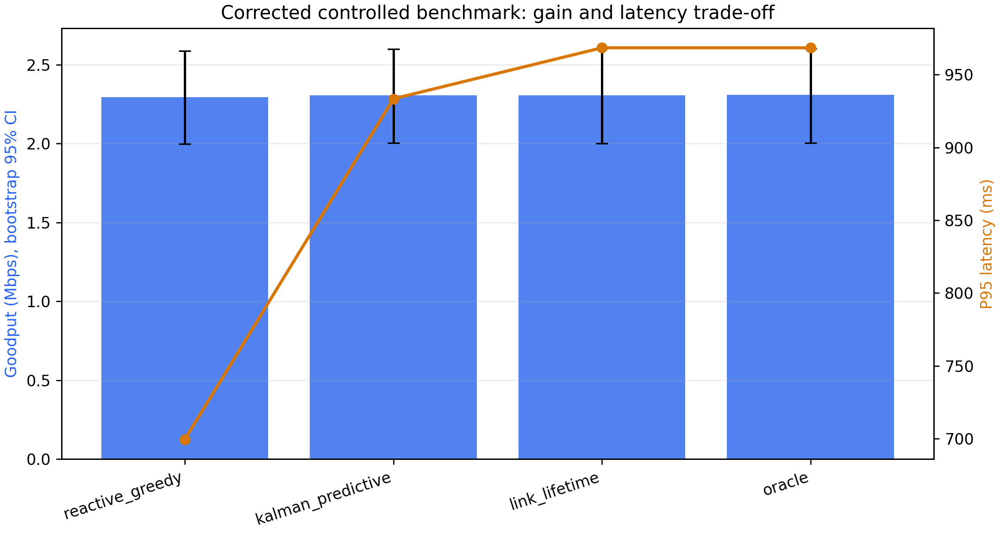
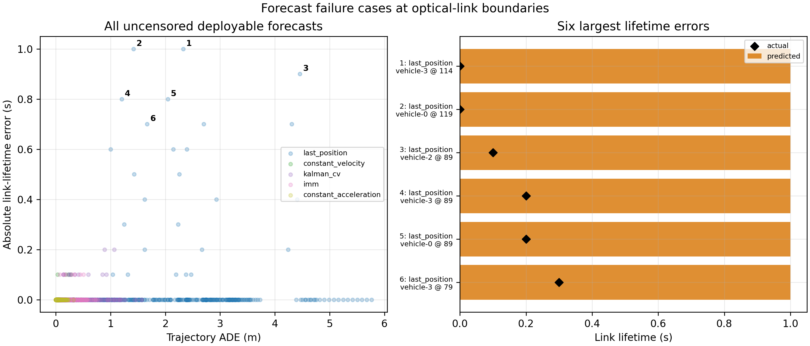
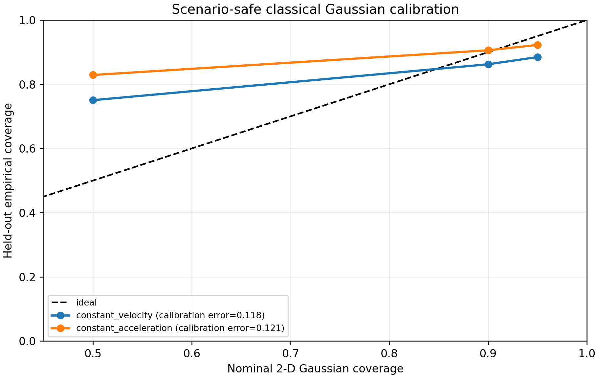
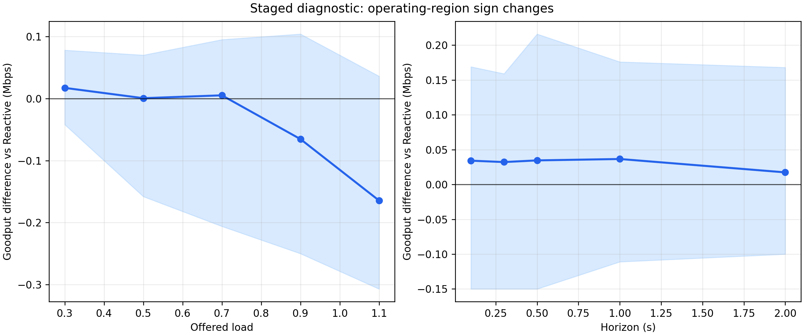
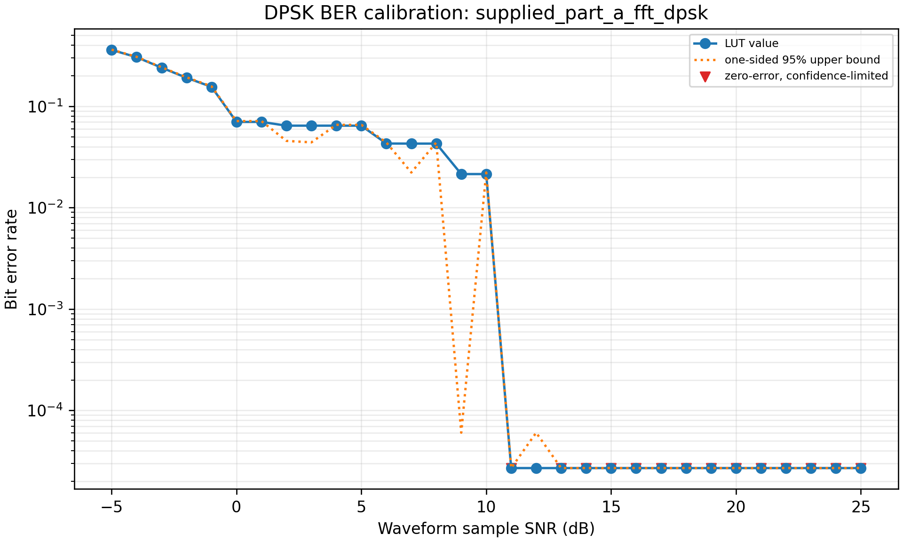

# Corrected reproduced results

All values on this page come from the isolated full run
`artifacts/corrected_v2/`. The manifest records that the Part-A receiver LUT
was used and that official WOMD, a learned checkpoint, and a measured optical
channel were **not** used.

## Verification

All 51 deterministic tests pass. Five scientific gates also pass: link quality
decreases with distance and pointing error; BER decreases with SNR; deployable
forecasts are invariant to hidden-future changes; the oracle changes when the
hidden future changes.

## Controlled 12-episode benchmark

| Policy | Goodput (Mbps) | PDR | P95 (ms) | Deadline+censored | Demand Jain |
|---|---:|---:|---:|---:|---:|
| Reactive Greedy | 2.2930 | 0.6439 | 699.6 | 0.3561 | 0.6717 |
| CV Predictive | 2.3053 | 0.6473 | 948.7 | 0.3527 | 0.6962 |
| Kalman Predictive | 2.3047 | 0.6472 | 933.3 | 0.3528 | 0.6948 |
| IMM Predictive | 2.3073 | 0.6479 | 948.7 | 0.3521 | 0.6949 |
| Predictive Utility | 2.3063 | 0.6476 | 965.4 | 0.3524 | 0.6972 |
| Link Lifetime | 2.3070 | 0.6478 | 968.3 | 0.3522 | 0.6993 |
| Oracle information | 2.3078 | 0.6480 | 968.3 | 0.3520 | 0.7000 |

Link Lifetime minus Reactive has mean goodput +0.0140 Mbps, bootstrap 95%
interval [-0.0319, +0.0593], win fraction 8/12, Cohen `dz=0.161`, raw
Wilcoxon `p=0.677` and Holm-adjusted `p=1.0`. Mean P95 latency is +268.8 ms
(worse), with Holm-adjusted `p=0.00439`. The default case therefore establishes
a tail-latency cost, not a goodput gain.

## Motion and link prediction

| Predictor | Synthetic ADE (m) | Synthetic SNR MAE (dB) | Proxy ADE (m) | Proxy lifetime error (s) |
|---|---:|---:|---:|---:|
| Last Position | 1.711 | 0.698 | 1.903 | 0.117 |
| Constant Velocity | 0.087 | 0.031 | 0.097 | 0.056 |
| Kalman CV | 0.352 | 0.083 | 0.328 | 0.026 |
| IMM | 0.176 | 0.053 | 0.212 | 0.054 |
| Constant Acceleration | 0.028 | 0.002 | 0.196 | 0.051 |
| Oracle | 0.000 | 0.000 | 0.000 | 0.000 |

Kalman ranks worse than Constant Velocity in proxy ADE but better in lifetime
error. This is direct evidence that geometric and communication-relevant
rankings need not coincide. Optical-boundary outliers are exposed separately:

## Compact real-motion proxy

Reactive obtains 1.160 Mbps and 0.329 PDR; Link Lifetime obtains 1.056 Mbps and
0.299 PDR. The mean difference is -0.104 Mbps across only three scenes. This is
a negative integration result, not official WOMD generalization.

## Classical probabilistic calibration

Gaussian residual wrappers were calibrated on six controlled scenario IDs and
evaluated on six disjoint IDs (7,050 target-step samples each). CV obtains RMSE
0.167 m, mean NLL -2.859 and calibration error 0.118; CA obtains RMSE 0.078 m,
mean NLL -4.522 and calibration error 0.121. Negative continuous-density NLL is
valid when a narrow Gaussian assigns density greater than one. Both baselines
over-cover the nominal 50% region and under-cover near 95%, so calibration is
not presented as perfect.

## Full five-seed staged study

The staged artifact contains 1,125 rows over 12 study axes. Selected paired
Link-Lifetime minus Reactive goodput results are:

| Setting | Mean difference (Mbps) | Bootstrap 95% interval | Win fraction | Holm p |
|---|---:|---:|---:|---:|
| Deadline 0.5 s | +0.1392 | [+0.0920, +0.1872] | 1.0 | 0.375 |
| Reference SNR +3 dB | +0.0504 | [+0.0442, +0.0560] | 1.0 | 0.375 |
| Reference SNR +6 dB | +0.0428 | [+0.0244, +0.0612] | 1.0 | 0.375 |
| Horizon 0.1 s | +0.0342 | [-0.0752, +0.1176] | 0.6 | 1.000 |
| Horizon 2 s | +0.0174 | [-0.0584, +0.1098] | 0.4 | 1.000 |
| Load 1.1 | -0.1644 | [-0.2572, -0.0626] | 0.2 | 0.625 |
| Deadline 0.05 s | -0.2318 | [-0.3438, -0.1032] | 0.2 | 0.375 |
| Urgent/bulk traffic | -0.1356 | [-0.2746, -0.0268] | 0.2 | 0.500 |

The positive bootstrap intervals at 0.5 s deadline and +3/+6 dB SNR are
hypothesis-generating, not corrected significance. With five paired values the
minimum two-sided signed-rank p-value is 0.0625; Holm correction further reduces
power.

## Urgent/bulk finding

Under the configured mixed-class setting, Reactive averages 2.167 Mbps, urgent
PDR 0.497 and bulk PDR 0.676. Link Lifetime averages 2.031 Mbps, urgent PDR
0.293 and bulk PDR 0.730. Its urgency rule prioritizes impending link closure,
not packet class, so it improves bulk service while seriously harming urgent
delivery. This is a concrete failure mode and motivates a class-aware utility.

## Part-A BER and complexity

The BER LUT uses the supplied FFT-carrier/DPSK receiver with waveform-sample
SNR. Zero-error points are confidence-limited; they are not reported as exact
zero BER.

On the recorded Linux/Python CPU run, median runtime per call was about 1.8 us
for Last Position, 6.4 us for CV, 17.5 us for CA, 976 us for Kalman and 1,029 us
for IMM. Reactive scheduling took 9.7 us and Link Lifetime 37.8 us. These are
machine-specific diagnostics. The GRU has 169,620 parameters, but no honest GRU
runtime exists without the learned runtime/checkpoint path.

## Defensible conclusion

Causal prediction changes the scheduling operating point, but it does not
universally improve communication. Its value is conditional on scheduling
flexibility, deadline pressure, link-boundary geometry, channel assumptions and
traffic class. Official WOMD and learned-model experiments are still required
for a submission claim.
