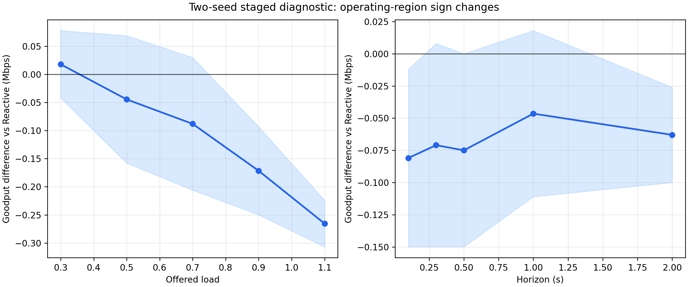

# Corrected reproduced results

All values on this page come from `artifacts/corrected_v1/`. They were produced
after the frame, stationary-heading, horizon-tail, physical-time, outage,
power-label, censoring and inference corrections. Older artifacts elsewhere in
the repository are retained as historical pre-fix evidence and are not mixed
with these results.

## Validation

| Gate | Result |
|---|---|
| Distance reduces link quality | PASS |
| Pointing error reduces link quality | PASS |
| BER decreases with SNR | PASS |
| Deployable forecast is future-invariant | PASS |
| Oracle changes when hidden future changes | PASS |

The complete deterministic suite passes 45/45 tests.

## Controlled 12-episode benchmark

| Policy | Goodput (Mbps) | PDR | P95 (ms) | Deadline+censored | Demand-normalized Jain |
|---|---:|---:|---:|---:|---:|
| Reactive Greedy | 2.2930 | 0.6439 | 699.6 | 0.3561 | 0.6717 |
| CV Predictive | 2.3053 | 0.6473 | 948.7 | 0.3527 | 0.6962 |
| Kalman Predictive | 2.3047 | 0.6472 | 933.3 | 0.3528 | 0.6948 |
| IMM Predictive | 2.3073 | 0.6479 | 948.7 | 0.3521 | 0.6949 |
| Predictive Utility | 2.3063 | 0.6476 | 965.4 | 0.3524 | 0.6972 |
| Link Lifetime | 2.3070 | 0.6478 | 968.3 | 0.3522 | 0.6993 |
| Oracle-information | 2.3078 | 0.6480 | 968.3 | 0.3520 | 0.7000 |

For Link Lifetime versus Reactive:

- mean goodput difference: +0.0140 Mbps;
- bootstrap 95% CI: [−0.0319, +0.0593] Mbps;
- goodput win fraction: 8/12 = 66.7%;
- paired Cohen `dz`: 0.161;
- Wilcoxon `p=0.677`, Holm-adjusted `p=1.0`;
- mean P95 latency difference: +268.8 ms, unfavorable;
- latency Wilcoxon `p=0.00049`, Holm-adjusted `p=0.00439`.

Therefore the corrected default benchmark does **not** establish a goodput
improvement. It does establish a tail-latency cost in this configuration.

## Lifetime-mechanism ablation

In the two-episode quick ablation, Predictive Utility, Link Lifetime and Link
Lifetime with `lifetime_weight=0` all produce 2.1655 Mbps. The explicit lifetime
term is inactive because no additional within-horizon link closure changes the
decisions in those episodes. This is a null ablation and is preserved.

It does not mean the code path is missing: exact scheduler tests verify that
shorter normalized lifetime increases urgency, and staged settings contain
cases where the policy decisions differ. It means the default operating point
does not isolate that mechanism.

## Motion and derived-link forecasting

| Predictor | Synthetic ADE (m) | Synthetic SNR MAE (dB) | Proxy ADE (m) | Proxy lifetime error (s) |
|---|---:|---:|---:|---:|
| Last Position | 1.711 | 0.698 | 1.903 | 0.117 |
| Constant Velocity | 0.087 | 0.031 | 0.097 | 0.056 |
| Kalman CV | 0.352 | 0.083 | 0.328 | 0.026 |
| IMM | 0.176 | 0.053 | 0.212 | 0.054 |
| Constant Acceleration | 0.028 | 0.002 | 0.196 | 0.051 |
| Oracle | 0.000 | 0.000 | 0.000 | 0.000 |

On the compact proxy scenes, Kalman has worse ADE than Constant Velocity but
lower lifetime error. This supports the methodological point that ADE ranking
and communication ranking need not coincide. Absolute proxy SNR MAE is large
near hard FoV transitions and must be interpreted with boundary slices.

## Compact real-WOMD motion with proxy ego

| Policy | Goodput (Mbps) | PDR | P95 (ms) | Censored+deadline |
|---|---:|---:|---:|---:|
| Reactive Greedy | 1.160 | 0.329 | 368.3 | 0.671 |
| Proportional Fair | 1.088 | 0.308 | 433.3 | 0.692 |
| Link Lifetime | 1.056 | 0.299 | 400.0 | 0.701 |
| Oracle-information | 1.056 | 0.299 | 400.0 | 0.701 |

Link Lifetime is −0.104 Mbps below Reactive on average. The interval
[−0.276, 0.000] and three scenes are not enough for final inference, but the
direction is negative. Roughly 70% of generated packets are deadline-dropped or
right-censored because the proxy evaluation window is only one second.

## Quick robustness ablations

These are two-episode diagnostics:

- full-channel Link Lifetime: 2.1655 Mbps;
- 0.5/1/2 m legacy coordinate-history noise: 2.0425/1.9760/1.9515 Mbps;
- 0.5/1/2 m direct forecast degradation: 2.1720/2.1520/2.1490 Mbps;
- range-only/range+pointing/full: 2.9835/2.9600/2.1655 Mbps;
- analytical BER versus adaptive LUT: 2.1655 versus 2.1430 Mbps.

Channel assumptions materially affect the numerical operating region.

## Staged operating-region diagnostic

The corrected staged run contains 430 rows: 43 one-axis settings × 2 seeds × 5
policies. Physical duration, deadline and horizon are held fixed except in the
study that intentionally changes each quantity.

The Link-Lifetime − Reactive mean goodput difference changes sign across load,
horizon, deadline, SNR, traffic and sensing settings. Examples include +0.018
Mbps at load 0.3, −0.172 Mbps at load 0.9, +0.104 Mbps at 0.5 s deadline and
−0.328 Mbps at 0.05 s deadline. With only two independent seeds these are
diagnostic signposts, not effect estimates.

## Defensible conclusion

The current evidence supports a causal, packet-level mechanism study and shows
that prediction can change throughput/fairness/latency trade-offs. It does not
support “prediction improves communication” as a general claim. The strongest
honest hypothesis for full evaluation is that value depends on scheduling
flexibility, link-closure geometry, deadline pressure and model uncertainty.
